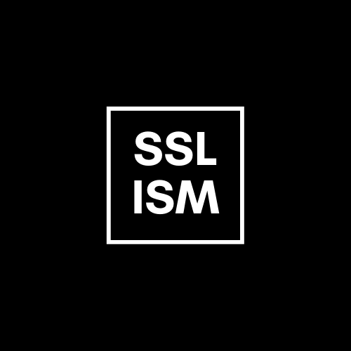

<h1 align="center">
   
  
   
  Semi-supervised learning → Instance Selection Methods 
   
</h1>

<h4 align="center">Instance selection methods for semi-supervised learning.</h4>

  <a href="#key-features">Key Features</a> •
  <a href="#setup">Setup</a> •
  <a href="#usage-guide">Usage guide</a> •
  <a href="#download">Download</a> •
  <a href="#credits">Credits</a> •
  <a href="#related">Related</a> •
  <a href="#license">License</a>

## Key Features

* TBD

## Setup

TBD

## Usage guide

TBD

## Download

TBD

## Credits

This software uses the following open source packages:

- [scikit-learn](https://sklearn.org)
- [NumPy](https://numpy.org)

## Related

TBD

## Support

## License

MIT

---

> GitHub [@dpr1005](https://github.com/dpr1005) &nbsp;&middot;&nbsp;
> Twitter [@callmednx](https://twitter.com/callmednx) &nbsp;&middot;&nbsp;
> LinkedIn [Daniel Puente Ramírez](https://www.linkedin.com/in/danielpuenteramirez/)

